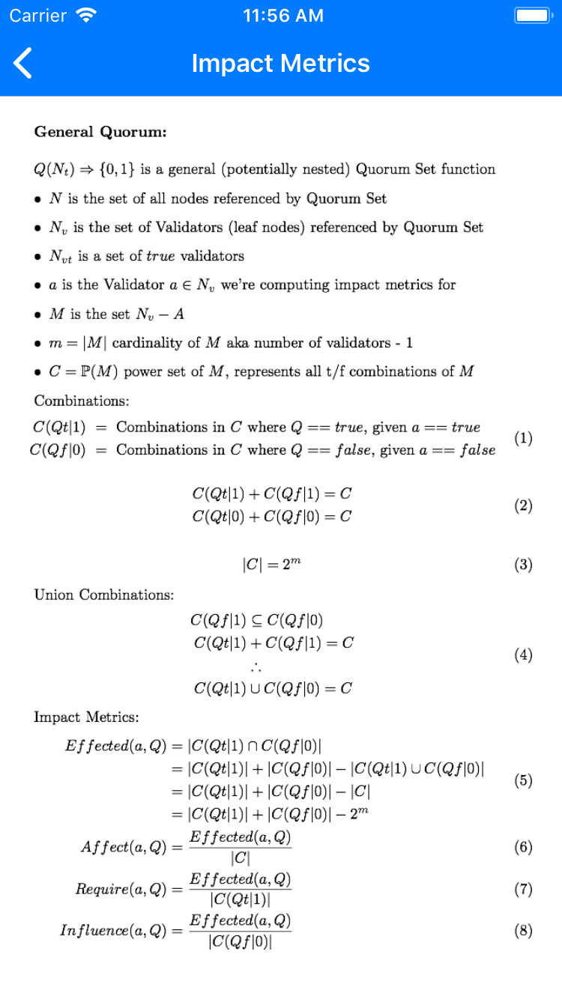

# NodeStar

This project aims to better visualize the Stellar network and its quorum sets. It includes:

* [iOS App - NodeStar](#ios-app---nodestar)
* [Math](#math)

Originally discussed [on Galactic Talk](https://galactictalk.org/d/1521-what-are-indicators-of-a-healthy-stellar-network/7)

## iOS App - NodeStar

It'll cost $0.99 from the App Store (coming soon) or build from source and install it with xcode for free!

We're creating an app that:

* parses information from [StellarBeat.io raw data](https://stellarbeat.io/nodes/dataset) -- Thanks StellarBeat!
  * [StellarBeat.io source](https://github.com/stellarbeat/js-stellar-node-connector)
  * eventually get the data ourselves
* displays interesting summary network & quorum set metrics
* displays list of all validators
* graphically visualizes a nodes quorum set
* computes some metrics on quorum set nodes - [see math below](#math)

Eventually:

* visualizes the network of all validators and their quorum sets
* computes some overall health metrics
* incorporates [Stellar White Paper concepts](https://www.stellar.org/papers/stellar-consensus-protocol.pdf) like Dispensable Sets

  
  
  

  
  
  

### Install From Source
* clone repo
* `cd NodeStar/iOS/`
* `pod update`
* `open NodeStar.xcworkspace` or open with finder
* run from xcode

## Math

We're developing standard language and metrics for discussing the stellar network and specific quorum sets dependence on a specific node or set of nodes.

Terms:

* **Effected** - count of combinations where the selected node impacts the quorum result
* **Affect** - how often the selected node has an impact on the quorum result
* **Require** - how often the selected node is required to be true for quorum truths
* **Influence** - how often the selected node influences the quorum result to true where it otherwise would have been false

### Part 1 - Quorum Impact Metrics

### Part 2 - Simple Quorum

### Part 3 - Recursive Quorum

