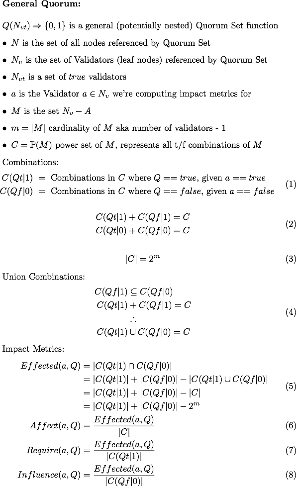
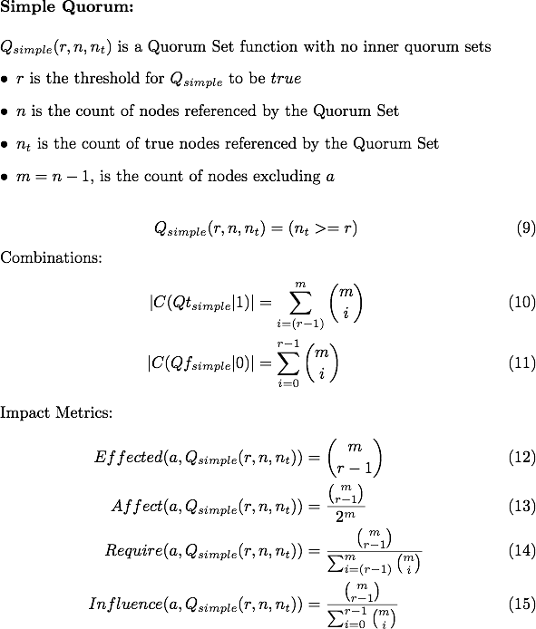

# NodeStar

This project aims to better visualize the Stellar network and its quorum sets. It includes:

* [iOS App - NodeStar](#ios-app---nodestar)
* [Math](#math)

Originally discussed [on Galactic Talk](https://galactictalk.org/d/1521-what-are-indicators-of-a-healthy-stellar-network/7)

## iOS App - NodeStar

It'll cost $0.99 from the App Store (coming soon) or build from source and install it with xcode for free!

We're creating an app that:

* parses information from [StellarBeat.io raw data](https://stellarbeat.io/nodes/dataset) -- Thanks StellarBeat!
  * [StellarBeat.io source](https://github.com/stellarbeat/js-stellar-node-connector)
  * eventually get the data ourselves
* displays interesting summary network & quorum set metrics
* displays list of all validators
* graphically visualizes a nodes quorum set
* computes some metrics on quorum set nodes - [see math below](#math)

Eventually:

* visualizes the network of all validators and their quorum sets
* computes some overall health metrics
* incorporates [Stellar White Paper concepts](https://www.stellar.org/papers/stellar-consensus-protocol.pdf) like Dispensable Sets

  
  
  

## Math

We're developing standard language and metrics for discussing the stellar network and specific quorum sets dependence on a specific node or set of nodes.

Terms:

* Effected - how often does node A have an effect on quorum set Q
* Effect() - fraction of node truthiness combinations where node A has an effect on quorum set Q
* Require() - fraction of node truthiness combinations where node A can veto, when Q otherwise would be true
* Influence() - fraction of node truthiness combinations where node A can overpower, when it Q otherwise would be false

### Part 1

### Part 2

