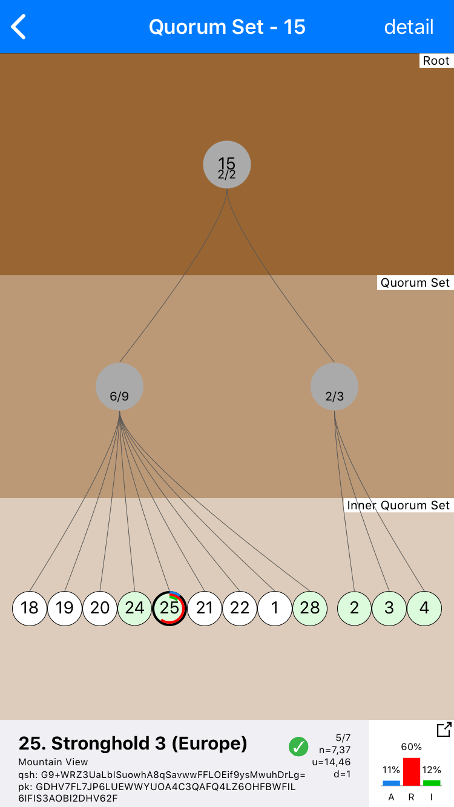

# NodeStar

This project aims to better visualize the Stellar network and its quorum sets. It includes:

* iOS App - [App Store](https://itunes.apple.com/us/app/nodestar-for-stellar/id1425168670?mt=8)
* React.js Web App - [https://nodestar.info](https://nodestar.info)
* [Math](#math)

Originally discussed [on Galactic Talk](https://galactictalk.org/d/1521-what-are-indicators-of-a-healthy-stellar-network/7)

## NodeStar - iOS App

[Install from App Store](https://itunes.apple.com/us/app/nodestar-for-stellar/id1425168670?mt=8) or [install from source](#install-from-source).

### V1.1.3
* Parses Validator and Quorum Set Info
  * from [StellarBeat.io raw data](https://stellarbeat.io/nodes/dataset) -- Thanks StellarBeat!
  * [StellarBeat.io source](https://github.com/stellarbeat/js-stellar-node-connector)
  * eventually get the data ourselves
* Network Summary Metrics
* Validator Clusters
  * graphically explore validator clusters
* Validators Detail
* Specific Quorum Sets
  * graphically explore the quorum and inner quorum sets
  * impact metrics of specific validator on a quorum set - [see math below](#math)

### Coming Soon:

* compute overall network health metrics
* incorporate [Stellar White Paper concepts](https://www.stellar.org/papers/stellar-consensus-protocol.pdf) like Dispensable Sets

  
  
  

  
  
  

### Install From Source
* clone repo
* `cd NodeStar/iOS/`
* `pod update`
* `open NodeStar.xcworkspace` or open with finder
* run from xcode

## NodeStar - React.js Web App

[https://nodestar.info](https://nodestar.info)

* hosted on github pages
* not as full featured (or pretty) as iOS

## Math

We're developing standard language and metrics for discussing the stellar network and specific quorum sets dependence on a specific node or set of nodes.

Terms:

* **Effected** - count of combinations where the selected node impacts the quorum result
* **Affect** - how often the selected node has an impact on the quorum result
* **Require** - how often the selected node is required to be true for quorum truths
* **Influence** - how often the selected node influences the quorum result to true where it otherwise would have been false

### Part 1 - Quorum Impact Metrics

### Part 2 - Simple Quorum

### Part 3 - Recursive Quorum

